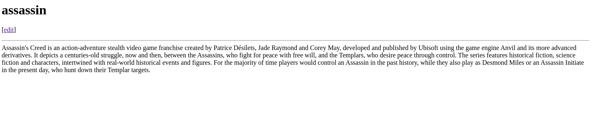

# go-web

This is a small web project here you can create a file view it or edit.
- For exemple, you can edit a html file and see the feedback when reload the page

## How to run:

```console
user@user$ go run server.go <"filename"> <"text to write in the file">
```

## Or 

```console
user@user$ go build server.go
user@user$ ./server <"filename"> <"text to write in the file">
```

## Visit:
- `localhost:8080`

## Exemples:

- Simple exemple:

```console
user@user$ go run server.go assassin "Assassin's Creed is an action-adventure stealth video game franchise created by Patrice Désilets, Jade Raymond and Corey May, developed and published by Ubisoft using the game engine Anvil and its more advanced derivatives. It depicts a centuries-old struggle, now and then, between the Assassins, who fight for peace with free will, and the Templars, who desire peace through control. The series features historical fiction, science fiction and characters, intertwined with real-world historical events and figures. For the majority of time players would control an Assassin in the past history, while they also play as Desmond Miles or an Assassin Initiate in the present day, who hunt down their Templar targets." .txt
Listen on poort :8080

```



- fun exemple:

```console
user@user$ go run server.go view "<body text="green"><h1>{{.Title}}</h1><p>[<a href=\"/edit/{{.Title}}\">edit</a>]</p><hr><div>{{printf \"%s\" .Body}}</div></body>" .html
Listen on port :8080

```

- This will change the html of the view page, and that you can edit it and view the changes
- You can change the couler